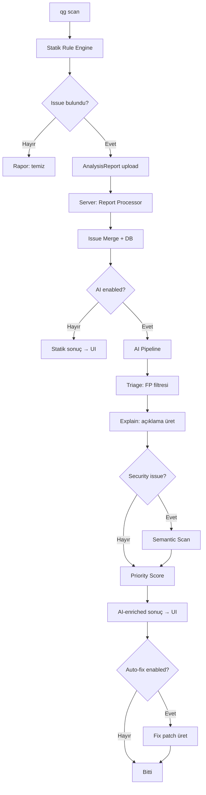
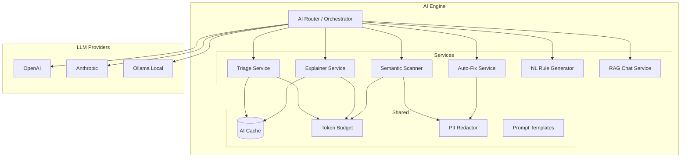
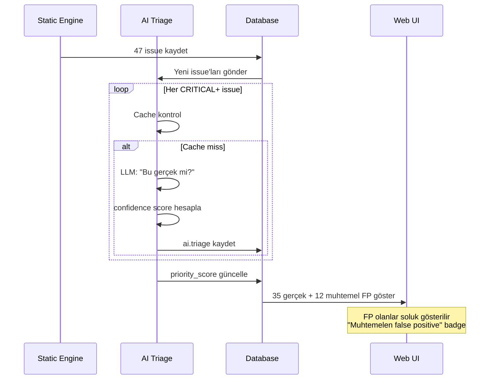
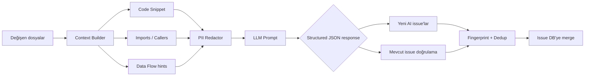
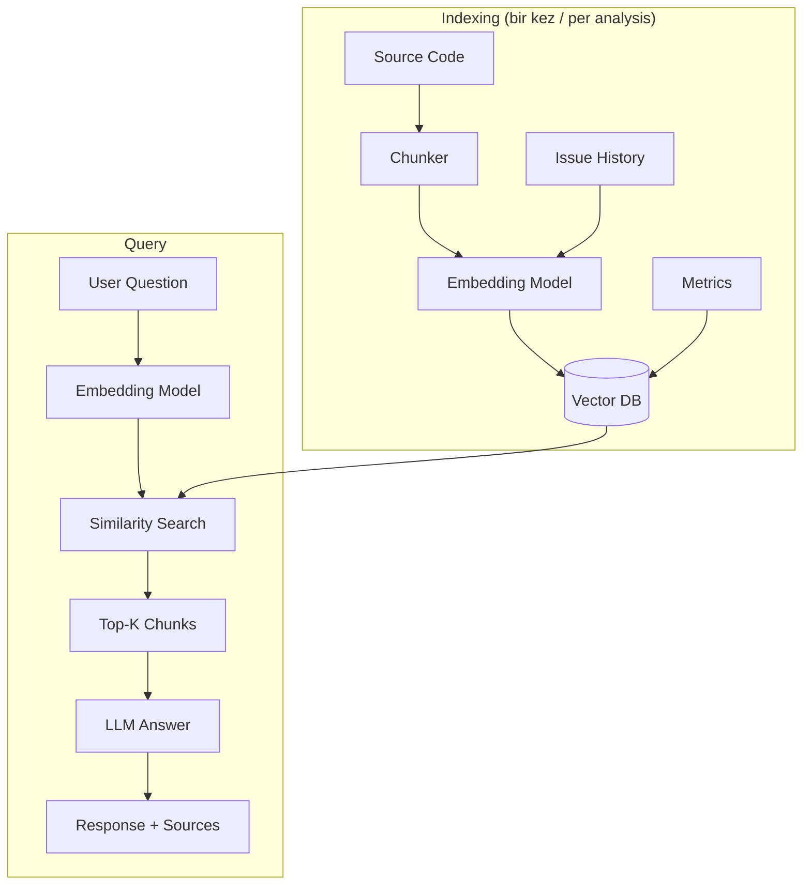
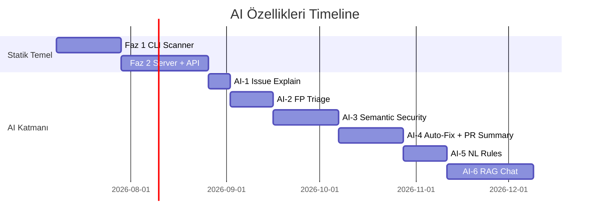
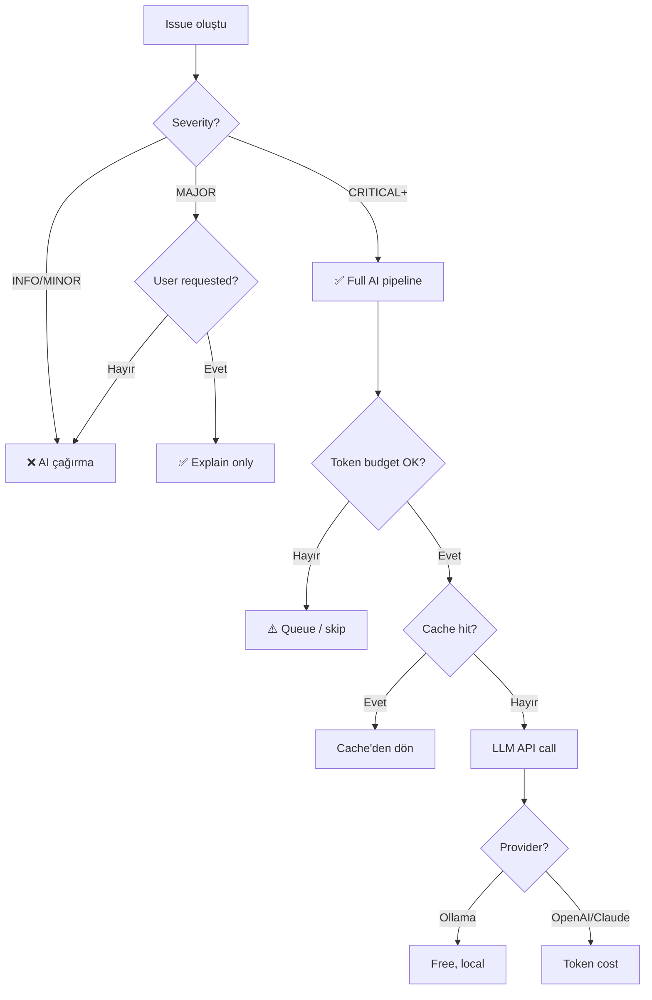

# AI Mimari Diyagramları

QualiGuard AI katmanı görsel akışları.

---

## 1. Hybrid Analiz Akışı (Statik + AI)

---

## 2. AI Engine İç Yapısı

---

## 3. Triage Akışı (False Positive Filtresi)

---

## 4. Semantic Security Scan

---

## 5. RAG Codebase Chat

---

## 6. AI Faz Timeline

---

## 7. Maliyet Karar Ağacı

