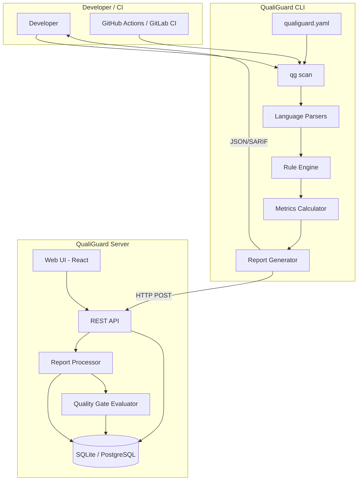
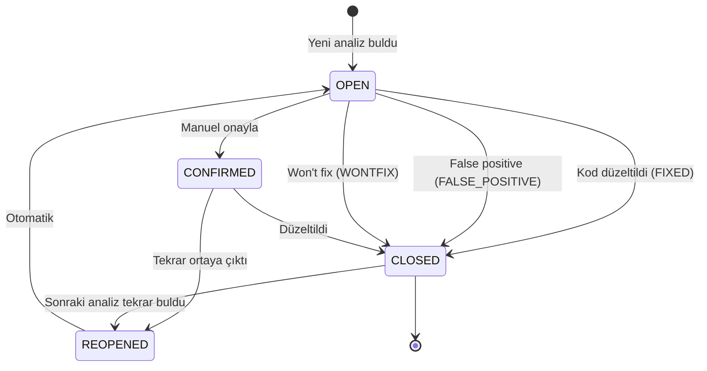
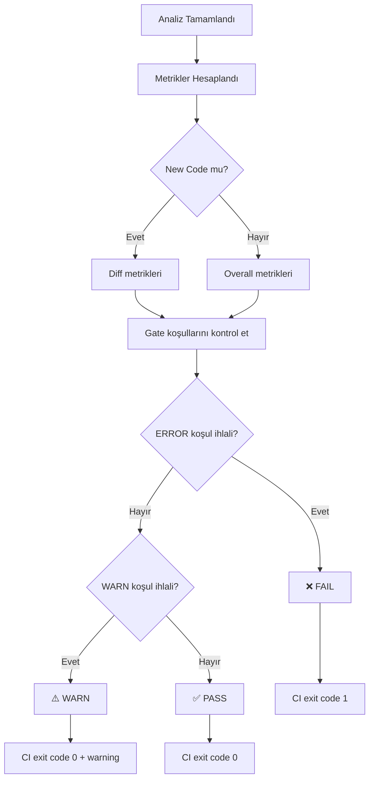
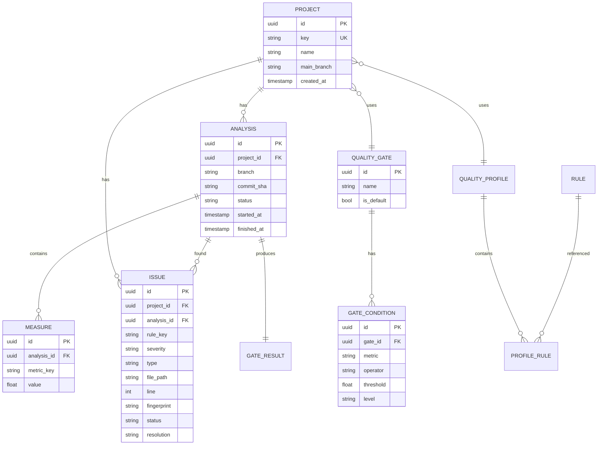
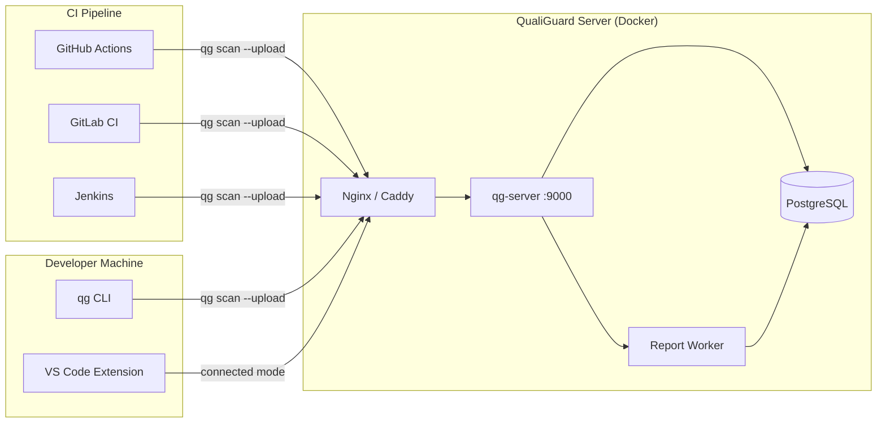
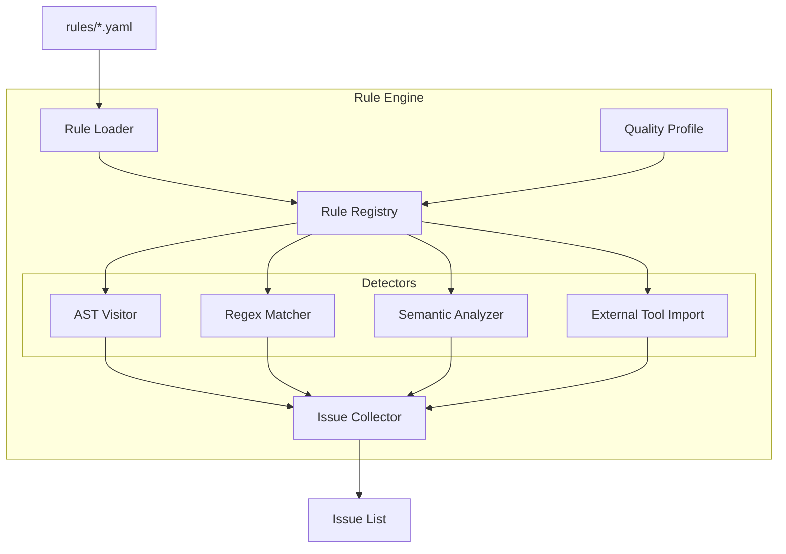
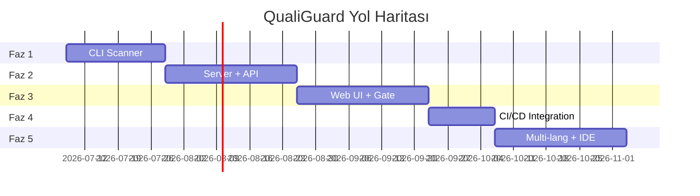

# Mimari Diyagramlar

QualiGuard sistem diyagramları (Mermaid).

---

## 1. Genel Sistem Mimarisi



---

## 2. Analiz Pipeline

```mermaid
sequenceDiagram
    participant CLI as qg scan
    participant DISC as File Discovery
    participant PAR as Parser
    participant ENG as Rule Engine
    participant MET as Metrics
    participant REP as Reporter
    participant SRV as Server
    participant WRK as Worker
    participant GATE as Quality Gate

    CLI->>DISC: sources + exclusions
    DISC-->>CLI: file list

    loop Her dosya
        CLI->>PAR: parse(file)
        PAR-->>CLI: AST
        CLI->>ENG: check(rules, AST)
        ENG-->>CLI: issues[]
    end

    CLI->>MET: calculate(all files)
    MET-->>CLI: measures

    CLI->>REP: generate(issues, measures)
    REP-->>CLI: AnalysisReport

    opt --upload flag
        CLI->>SRV: POST /api/v1/analyses
        SRV->>WRK: queue report
        WRK->>WRK: issue fingerprint merge
        WRK->>GATE: evaluate conditions
        GATE-->>SRV: PASS/FAIL
        SRV-->>CLI: gate result
    end
```

---

## 3. Issue Yaşam Döngüsü



---

## 4. Quality Gate Akışı



---

## 5. Veri Modeli (ER)



---

## 6. Deployment Mimarisi



---

## 7. Rule Engine İç Yapısı



---

## 8. Faz Timeline


